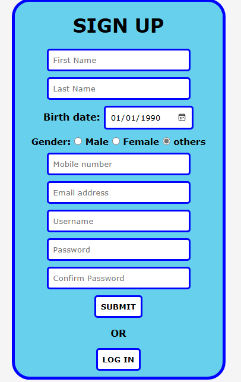

# PHP Login & Signup System

A simple PHP-based login and signup system that allows users to create accounts, log in, and manage sessions. This project demonstrates how to build a secure authentication system using PHP, MySQL, and basic HTML forms.

## Features

- **User Registration**: Users can sign up by providing their email, username, first name, last name, and birth date and password.
- **Login**: Users can log in to the system with their username and password.
- **Session Management**: Secure session management to keep users logged in.
- **Password Hashing**: Passwords are securely hashed using PHP's `password_hash()` and `password_verify()` functions.
- **MySQL Database**: Stores user data in a MySQL database.
- **Basic Input Validation**: Simple validation on user input to prevent SQL injection and XSS attacks.

## Prerequisites

Before you begin, ensure you have the following installed:

- PHP (version 7.4 or higher)
- MySQL
- Apache or any other PHP web server
- A text editor or IDE (e.g., VS Code, Sublime Text)
